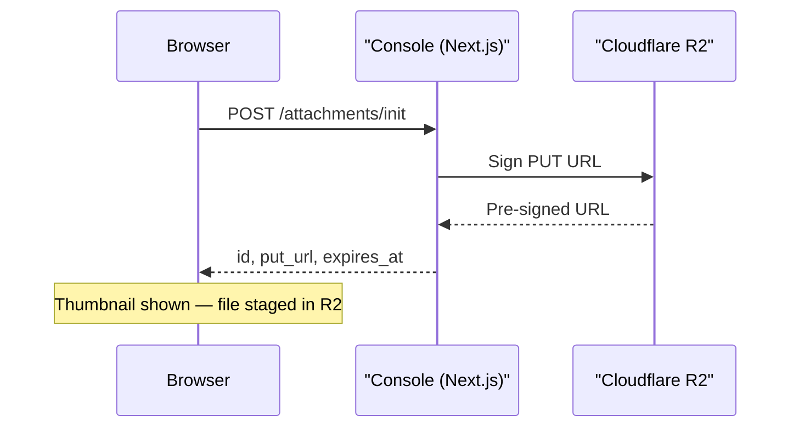
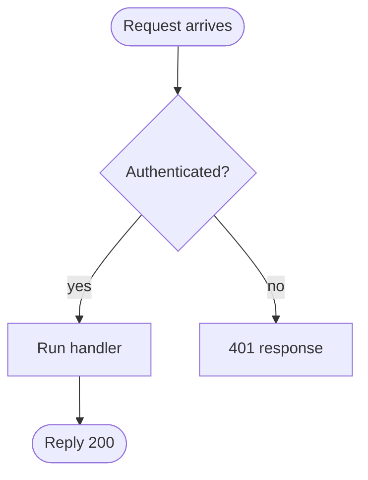
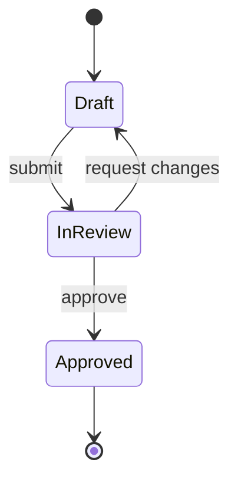
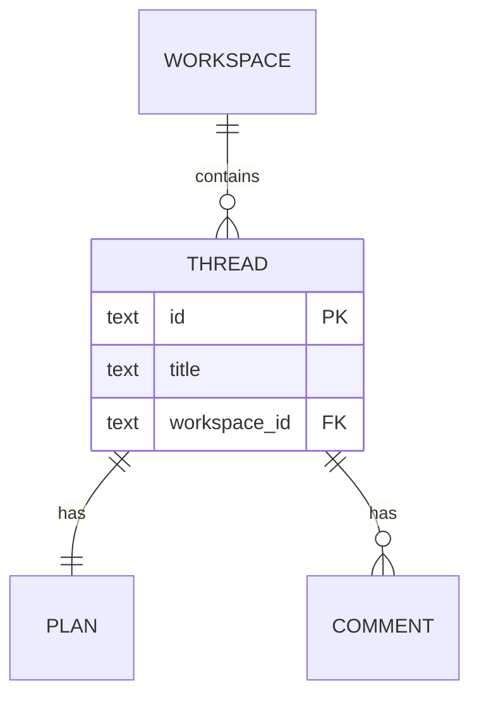

# Mermaid diagrams in Tempo Plans

The Console renders Mermaid source as live SVG. The Agent writes the source; the server stores it byte-for-byte; the renderer fails loudly if the source is invalid. There is no validation loop back to the Agent — get it right on the first write.

## When to reach for Mermaid

A diagram earns its place only when the reader would otherwise have to mentally draw the picture. Use Mermaid for:

- **Sequence of interactions** — request lifecycle, message-passing between services, a multi-step protocol handshake. (sequenceDiagram)
- **State machine** — a value that has discrete states and transitions, especially when invariants depend on the transitions. (stateDiagram)
- **Data model relationships** — entities with foreign keys, cardinalities that matter, a schema worth discussing. (erDiagram)
- **Branching strategy** — git workflow, release-train shape. (gitGraph)
- **Decision/control flow** — process with branches the reader will trace through. (flowchart)
- **System architecture** — modules and their dependencies, request paths through tiers. (flowchart with subgraphs, or block-beta)

Skip Mermaid when:

- A short bulleted list or a paragraph carries the same information.
- The diagram would have fewer than ~4 nodes (the prose is shorter and easier to scan).
- The diagram would have more than ~15–20 nodes (it stops being legible — split it or step down to prose).
- You're tempted to draw something because it looks impressive. Diagrams have a review cost; spend it deliberately.

If you're not sure, ask the Dev in a Discussion message before adding one mid-iteration. For first drafts, be opinionated — don't ask permission.

## Authoring rules (read every time)

These are not suggestions. They cause silent parse errors in the rendered Plan that the Dev sees as a red box.

### Mermaid grammar gotchas

1. **Semicolons are statement separators.** Mermaid treats `;` the same as a newline. In any text body (Note, message label, node label), use `,` or `—` or just rephrase. Never `;`.
   - Wrong: `Note over B: Thumbnail shown; file staged in R2`
   - Right: `Note over B: Thumbnail shown — file staged in R2`
   - If you genuinely need a literal `;` inside text, escape it as `#59;`.

2. **The word `end` breaks flowcharts and sequence diagrams.** It's a reserved keyword that closes blocks. If you need it as a label, wrap it: `["end"]` or `("end")` or `{"end"}`.

3. **Aliases or labels with `()` need quoting.**
   - Wrong: `participant C as Console (Next.js)`
   - Right: `participant C as "Console (Next.js)"`

4. **Messages starting with `{` confuse the parser.** Quote the message text or rephrase.
   - Wrong: `C-->>B: { id, put_url, expires_at }`
   - Right: `C-->>B: "{ id, put_url, expires_at }"` or `C-->>B: id, put_url, expires_at`

5. **ASCII only.** No smart quotes (`"` `"` `'` `'`), no em-dash from a docs paste (`—` is fine because it's a single Unicode em-dash, but be deliberate). Plain `-`, `>`, `"`, `'`. Non-ASCII characters routinely produce "Parse error" with no useful location.

6. **One statement per line.** Don't pack multiple arrows on one line. Each node and each edge gets its own line.

7. **Balance every bracket.** `[`, `(`, `{`, `<` must close. The parser's error messages on unbalanced brackets are usually wrong about the line number — count manually if it complains.

8. **Encode `#` as `#35;`** if you need a literal `#` inside a label (it's the lead-in for character escapes).

### Tempo wrapper

The Console only renders the block when the source is wrapped exactly like this:

```html
<pre><code class="language-mermaid">
...mermaid source...
</code></pre>
```

Without `class="language-mermaid"` (or `data-language="mermaid"`) the block renders as a plain code fence. The class is load-bearing.

### Style and size

- **Keep diagrams under ~15 nodes.** If you need more, split into two diagrams (e.g. "happy path" and "error path") or step down to a prose description with a smaller diagram for the trickiest part.
- **One concept per diagram.** Don't try to show data flow + control flow + deployment topology in one picture.
- **Declare direction explicitly** for flowcharts (`flowchart TD` for top-down, `LR` for left-right). Don't rely on the default.
- **Comment with `%%`.** Use sparingly — diagrams aren't code, they don't usually need running commentary.
- **Stable, short ids; human-readable labels.** `B-->>C: POST /attachments/init` is fine. `Browser-->>ConsoleNextJsServer: ...` is noise.

## Diagram type rubric

Pick the type before writing a single line. The wrong type for the message is harder to fix than a syntax bug.

| Type | Use when… |
|---|---|
| `flowchart` | Decision tree, control flow, system architecture sketch, anything with branches the reader traces. |
| `sequenceDiagram` | Two or more participants exchanging messages over time. Request lifecycle, protocol handshake. |
| `stateDiagram-v2` | Discrete states with transitions. Always prefer `-v2` (current grammar). |
| `erDiagram` | Database schema design, foreign-key relationships, cardinality discussion. |
| `gitGraph` | Branching strategy, release flow. |
| `classDiagram` | OO model with inheritance, composition, multiplicities. Rarely the right tool; prefer `erDiagram` if you're discussing data. |
| `mindmap` | Brainstorming, hierarchical decomposition. Avoid for technical docs — it reads as fuzzy. |
| `timeline` | Roadmap, sequence of milestones with dates. |

If you'd reach for `block-beta`, `architecture-beta`, `quadrantChart`, `sankey`, `radar`, `xyChart`, `kanban`, `packet`, `requirement`, `c4`, `userJourney`, `treemap`, or `zenuml`: re-evaluate. They are rarely the right answer in a Plan. Use one of the eight above unless you have a specific reason.

## Quick syntax — sequence diagram

The most common diagram in Tempo Plans. Memorise this skeleton.



- `->>` is a solid arrow (call).
- `-->>` is a dashed arrow (response).
- `Note over X: …` annotates a participant.
- `Note over X,Y: …` annotates a span across participants.
- Use `loop`, `alt`/`else`, `opt`, `par`/`and`, `critical` for control flow — each opened with the keyword and closed with `end`.

## Quick syntax — flowchart



- Shapes: `[rect]`, `(round)`, `([stadium])`, `[[subroutine]]`, `[(cylinder)]`, `((circle))`, `{diamond}`, `{{hexagon}}`.
- Arrows: `-->`, `---`, `-.->`, `==>`. Label on arrow: `-->|label|`.
- Subgraphs: `subgraph name … end`. Yes, `end` again — be careful with labels inside.
- Always declare `flowchart TD` or `flowchart LR` on line 1. Don't rely on default.

## Quick syntax — state diagram



- `[*]` is the start/end pseudo-state.
- `state "Long name" as ShortId` for labels with spaces.

## Quick syntax — ER diagram



- Cardinality: `||` exactly one, `o|` zero or one, `o{` zero or many, `|{` one or many. Pair them across the relationship line.
- Entity blocks are optional but useful when the schema itself is the discussion.

## Before you write

Run this checklist mentally against every diagram you produce:

- [ ] Does prose carry the same information? If yes, skip the diagram.
- [ ] Picked the right diagram type for the question being answered?
- [ ] Under ~15 nodes?
- [ ] Every text body free of `;` and reserved-keyword landmines?
- [ ] Every alias/label with `()` is quoted?
- [ ] ASCII-only, balanced brackets, one statement per line?
- [ ] Wrapped in `<pre><code class="language-mermaid">…</code></pre>`?

The diagram you don't write is faster to review than the one you do.
