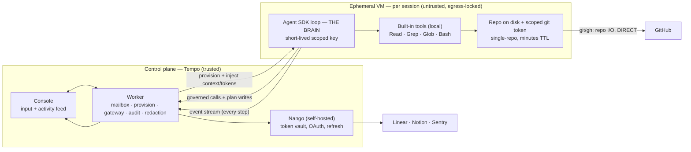
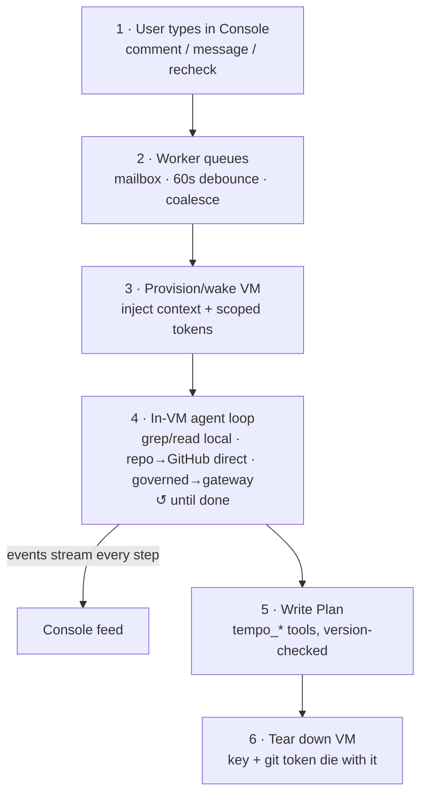
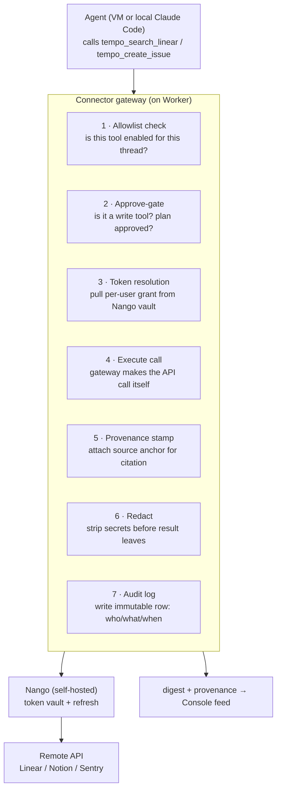

# Tempo — System Architecture

**Status:** decided baseline
**Thesis:** Agents execute fast; people under-plan, so agents produce slop. Tempo is the human-in-the-loop planning and approval layer between intent and agent execution. The Plan is the artifact; everything else is scaffolding to make sure the right person produces a Plan their team trusts.

---

## 1. Core principles

These were derived repeatedly and the whole design hangs off them. When a decision is ambiguous, fall back to these.

1. **The Plan is the source of truth.** Tempo is not a memory layer. All durable state lives in the artifact (Plan + comments + discussion + anchored quotes). Agents and VMs are disposable; the artifact is not.
2. **One agent identity, two runtimes.** A thread is served by either the user's own runtime (local) or Tempo's hosted runtime — never two reasoning loops fighting over one Plan. No mode picker beyond the one-time Local/Hosted choice.
3. **One writer per thread.** Serial within a thread is the consistency model, not a limitation. Parallelism lives *across* threads and *within* a turn (subagents), never across writers on one Plan.
4. **The contract is frozen; everything behind it is swappable.** The `tempo_*` tool contract (Zod schemas) is the stable interface. Runtime location, VM provider, connector backend, and model are all implementation details behind it.
5. **Witness ≠ execution.** Work runs wherever it runs; the Console is where it is *seen*. The runtime that can be witnessed cleanly (hosted) is the one teams trust for async work.
6. **Secure the exit.** (Composio-breach lesson.) Isolation comes from egress control + ephemerality + scoped short-lived credentials, not from trusting the execution sandbox.

---

## 2. Runtimes

Two, chosen per thread. Same `tempo_*` contract across both — a tool written once works in either.

### Local (free tier, BYO runtime)

The user runs **their own Claude Code**; Tempo is a remote MCP server it connects to. We do not embed or drive a harness.

- ToS-clean: their official binary, their subscription, their tokens. No Anthropic credential ever passes through Tempo.
- Zero inference COGS for us.
- Strongest privacy story: source code never leaves the user's machine.
- Agent-agnostic for free — Cursor, Codex, etc. connect to the same MCP endpoint.
- Onboarding: `tempo-agent init` runs an OAuth login and saves the user-scoped token to `~/.tempo/credentials.json` — it does **not** write any repo file. `tempo-agent connect <thread-id>` writes an ephemeral `/tmp/tempo-<pid>.json` MCP config carrying the Bearer token and spawns the user's own `claude` binary against it; the temp file is unlinked when the wrapper exits. Teammates each run `tempo-agent init` once (per machine) to mint their own credential; there is nothing to check in.
- **Limit:** synchronous only. The agent works while the user's session is open. Async (a comment 40 min later) is owned by the hosted runtime, by design.

### Hosted (paid tier, Tempo-operated)

An **Agent SDK loop running inside an ephemeral VM** (agent-in-VM model). This is the always-on async brain and the only runtime that answers comments when no local session is live.

- API keys (Tempo-metered or BYOK).
- Provisions a VM lazily — only when the task needs code/repo work. Pure planning (marketing plans, discussions, non-code threads) runs the SDK loop with no VM, calling connectors directly.
- Owns async: scheduled rechecks, comments-while-you're-away, post-approve writes.

**Why agent-in-VM (not split brain/hands):** tool calls run in-process against local disk — no per-call network tax on `grep`/`read`. Cost is that the model loop (holding a key) sits next to agent-run code; mitigated by the VM being per-session, egress-locked, and torn down with short-lived scoped credentials.

---

## 3. Where the agent lives (hosted)

- **Brain in the VM**, control plane on the worker. The worker never runs agent-generated code.
- **Two exit paths** (see §5 and §6): repo I/O goes *direct* to GitHub with a scoped git token; governed connector calls loop *back through the worker gateway*.
- The VM can reach exactly three things: Anthropic API, GitHub, the worker. Nothing else.

---

## 4. Input flow (hosted)

**Mailbox / actor model.** Each thread is an actor with a queue. New events (comment, reply, discussion, recheck) enqueue; the loop holds one in-flight turn, then drains *everything* pending into one batched turn ("2 comments + 1 message since last turn: ..."). Debounce ~60s so bursts coalesce. Idempotency keys per item; one reply per batch. This is cheaper (one context pass, not three) and contradiction-free (one writer sees all pending items).

**Routing decision per turn:**
- Active local session on this thread? → route there (free, full fidelity).
- Else hosted. Needs code/repo work? → provision VM. Else → lightweight worker, no VM.

---

## 5. Connector gateway

The gateway is the **single chokepoint for all governed connector calls** from either runtime. It is where Tempo's product value (audit, approval, provenance) is enforced. It is *not* a generic tool router and it does *not* execute repo I/O.

### What flows through it vs what doesn't

| Call type | Path | Why |
|---|---|---|
| `git clone`, `gh`, repo reads | **Direct from VM**, scoped git token | This is the local-disk work the VM exists for. Routing it through the gateway would re-introduce the network tax we went agent-in-VM to avoid. |
| Linear/Notion/Sentry/Slack reads + writes | **Through the gateway** | These need audit, approve-gating, provenance, and per-user scoping. |

Rule of thumb: **repo I/O is local and fast; governed actions are audited and slow.** Don't make `git clone` a gateway call; don't make "post to Slack" a raw shell-out.

### Gateway responsibilities

1. **Allowlist** — each thread has a set of enabled connectors, and each tool is classified read or write. Tools not enabled for the thread don't exist to the agent.
2. **Approve-gate** — write tools (`tempo_create_linear_issue`, `tempo_publish_notion`, etc.) are denied until the Plan is approved. During drafting, only reads are exposed. Enforced by *tool availability* (the SDK `canUseTool` hook + dynamic tool registration), not by asking the model to behave. The Approve button is the permission boundary.
3. **Token resolution** — the gateway pulls the **per-user** OAuth grant from the self-hosted Nango vault. Per-user (not workspace service account) so the agent in Shyam's thread sees only what Shyam can see. Workspace-level grants (e.g. a GitHub App installation) are used only for org-owned resources.
4. **Execute** — the gateway makes the API call **itself** (or via Nango's proxy, but prefer self-execution for data-path control). Tokens at rest never leave the VPC because Nango is self-hosted.
5. **Provenance** — retrieval results are stamped with their source so the agent can anchor Plan sections to them ("this exists because of [Linear PROJ-123]"). This is the citation/source-of-truth feature.
6. **Redact** — results pass through the worker, so the worker scrubs secrets/tokens/env values before anything reaches the Console feed. The VM is not trusted to self-censor.
7. **Audit** — every governed call writes an immutable row. This is the artifact you show a security team.

### Auth model summary

- **Nango = auth only** (OAuth dance, vault, refresh). Self-hosted so tokens stay in your VPC.
- **Gateway = everything the agent touches** (allowlist, approve-gate, execution, provenance, audit, redaction).
- **Per-user grants** wherever the API supports it; workspace grants only for org-owned resources.
- Don't route execution through Nango's proxy — keep the data path, audit, and enforcement in code you own. (Post-Composio-breach posture: minimize what any third party holds and executes on your behalf.)

### Connector backends (behind the gateway, swappable)

The gateway exposes `tempo_*` tools; what fulfills them is an implementation detail with three flavors:

- **First-party remote MCP server** (GitHub, Linear, Notion, Sentry, Atlassian) — OAuth 2.1 + Dynamic Client Registration means **no developer-portal app registration**. One MCP-client auth implementation in the gateway covers all of them. This is the default for Ring 1.
- **Aggregator** (Composio or Nango-managed apps) — for services without good first-party MCP coverage (Google Workspace, Slack, Microsoft/Entra, the long tail). Trades a vendor in the data path for zero portal setup. Adopt at the tripwire: first paying customer requests a connector with no first-party MCP server.
- **Hand-rolled REST** — one-offs against your own OAuth app, only when justified.

Any single connector can be silently upgraded between backends without touching an agent, a Plan, or a user.

---

## 6. VM lifecycle

### Provision
- Provider: **Fly Sprites** (hardware-isolated micro-VM, sub-second start, per-second billing, checkpoint/rollback). REST `exec` to start; graduate the hot path to a persistent in-VM MCP server when per-call HTTP overhead bites.
- Lazy: only for code/repo work. Provision in the background the instant a hosted thread looks code-related, so the clone overlaps the agent's first reasoning.
- Clone shallow: `git clone --depth 1 --filter=blob:none` — repo on disk in seconds.
- Inject: short-lived scoped API key + single-repo git token (GitHub App installation token, minutes TTL).

### Egress lock (non-negotiable)
The VM's network allowlist permits: **Anthropic API, GitHub, the worker.** Nothing else. This is the mitigation that makes agent-in-VM safe — compromised agent-generated code can run, but it can't phone home or reach the credential it would want to steal.

### Teardown — on Plan generation, always
The VM holds live credentials, so it dies. Key dies, git token dies, disk gone.

### Resume — rebuild, do NOT snapshot
When a new comment arrives later, do **not** restore a VM memory snapshot (heavy to store, provider-locked, and it preserves secrets and stale state you want gone). Instead:

1. **Persist context as data** — the artifact (authoritative) in Postgres. Optionally the SDK message transcript (convenience, so the agent doesn't re-derive prior exploration). The artifact alone is enough because Tempo is not a memory layer.
2. **Resume = fresh VM + rehydrate from artifact + re-clone repo.** The agent rebuilds its state from the Plan + comment + discussion, not from a frozen process.

**Caveat:** uncommitted VM scratch work dies on teardown. By design — the deliverable is the Plan, and anything that matters is either *in the Plan* or *committed*. Don't let the VM accumulate state you'd miss.

### VM lifetime policy
Start **per-turn** (tear down after each turn, re-clone next time — clone is cheap with `--depth 1`). Move to **per-thread-session** (keep warm across a few turns) only if re-clone latency becomes a real complaint. Don't pay idle for warm VMs prematurely.

---

## 7. Agent layer

**Use the Agent SDK as a library (hosted). Use the user's Claude Code as-is (local). Never write a raw agent loop.**

- Raw loop → rebuilding compaction, tool dispatch, retry, subagents, session resume. All commodity. Skip.
- Claude Code as a binary (hosted) → it's a *product* with coding-tuned defaults and its own UX/auth; you'd fight it to embed and to do planning instead of coding. Wrong fit for hosted.
- Agent SDK → the loop without the product. You inject the key, register tools, wrap the permission hook, pipe events.

### What the SDK gives you
The loop, built-in `Read`/`Grep`/`Glob`/`Bash` operating on the VM's **local disk**, tool-call parsing, compaction, session state, subagent spawning.

### What you write
1. **Governed `tempo_*` tools** — the gateway calls (`tempo_create_linear_issue`, `tempo_search_notion`, plan-write tools). Reads/writes that need governance.
2. **`canUseTool` permission gate** — the approve-rule (deny write tools until `plan.approved`) and egress discipline.
3. **Event forwarder** — pipe the SDK event stream (tool_use, tool_result, thinking, text deltas) to the worker → Console.
4. **Boot harness** — inject key, clone repo, start `query()`.

### "Read a file and summarize" — what's custom?
**Nothing, beyond having the harness running.** `Read` is a built-in that does a local `open()` in the VM; "summarize" is the model reasoning over what `Read` returned — not a tool. The interesting code is all in the *governed* and *plan-write* tools, not in reading files. (Only custom-code reads if you need a path allowlist or secret-stripping — then disable `Read`, ship `tempo_read_file` with your guard.)

### Orchestration policy is yours (this is the IP)
The SDK gives primitives; **you decide the behavior** — and that's correct for Tempo, because Claude Code's baked-in policy is tuned for *coding*, not *planning*.

- **System prompt** = the planning behavior ("draft Plans, ask structured questions under ambiguity, cite sources, do not write code"). This is more of the product than any tool.
- **Subagents** = your configs: a Haiku `explorer` for the wide grep sweep, a `critic` for the adversarial pass. Subagents never get `tempo_ask_question` (one-shot, can't converse) and never get write tools.
- **Fan-out triggers** = orchestrator instructions ("for N comments, investigate in parallel, write serially"). Reads parallelize; writes never do.

**Build it lazily:** start single-agent with a strong planning system prompt. Add the `explorer` subagent only when the orchestrator's context bloats on exploration. Add the `critic` when draft quality needs it. Let multi-agent structure be pulled by observed need.

### Cost discipline
- Subagents on Haiku-class models; big model only for synthesis. This directly stretches the (metered or BYO) token budget.
- A code-exploration agent searches its way to ~10 files (`grep`/`glob` first), it does not read 300. Fewer calls, less context, better reasoning.

---

## 8. Security model (summary)

| Surface | Control |
|---|---|
| Model key next to agent-run code | Short-lived, scoped, per-session. BYOK preferred (blast radius = user's account). |
| Repo access | GitHub App installation token, single-repo, minutes TTL. |
| Exfiltration | **Egress allowlist** (Anthropic + GitHub + worker only). Ends the kill chain even if execution is compromised. |
| VM persistence | Per-session, ephemeral, torn down with credentials. No reuse. |
| Connector tokens | Per-user grants, self-hosted Nango vault, never leave VPC. |
| Untrusted connector content (prompt injection) | Read-only during draft; retrieved content stamped as data/provenance, not instructions; gateway redacts before Console. |
| Secrets in event stream | Scrubbed at the worker relay (stream passes through worker), not trusted to the VM. |
| Slack specifically | Verify current API/LLM-ingestion terms before shipping; per-user, query-scoped reads only. |

---

## 9. Tech choices

| Layer | Choice | Note |
|---|---|---|
| Hosted agent | Claude Agent SDK (in-VM) | model param → multi-model later via gateway/LiteLLM if a customer demands |
| Local agent | User's Claude Code via remote MCP | ToS-clean, agent-agnostic, zero COGS |
| VM | Fly Sprites | sub-second start, per-second billing, checkpoint/rollback, egress control |
| Connector auth | Nango (self-hosted) | OAuth + vault + refresh; tokens stay in VPC |
| Connector backends | First-party MCP + DCR (Ring 1); aggregator at tripwire (long tail) | no portal setup for DCR-capable providers |
| Queue/async | Postgres outbox + Graphile Worker / pg-boss | events written in same txn (no lost events) |
| Console transport | SSE | activity feed = SDK events relayed through worker |
| Contracts | Zod schemas (`packages/contracts`) | frozen interface across runtimes |
| DB | Postgres | thread state, artifact, audit log, optional transcript |

---

## 10. Build order & tripwires

**Order:** (1) harden local daemon + activity feed + open-source CLI/contracts → onboard design partners; (2) hosted SDK worker, async-only, mailbox + recheck, no connectors; (3) gateway + Ring 1 reads (GitHub/Linear/Notion via first-party MCP) with provenance; (4) approve-gated writes (Plan→Linear issues, Notion publish) — the demo that sells; (5) read-only Tempo MCP server for approved Plans + directory listings (distribution); (6) launch.

**Tripwires (act only when fired):**
- **Aggregator (Nango-managed/Composio):** first paying customer needs a connector with no first-party MCP server.
- **Persistent per-workspace VM (full Zo surface):** customers pull you toward always-on hosting/automations.
- **Multi-model in hosted:** an enterprise prospect makes it a condition.
- **Ring 2 (PM/marketing templates):** an existing customer's non-dev teammate asks to run a thread. Expansion, not new GTM.
- **Fundraise:** 10 active workspaces + 4 weeks of approved-plans-per-week climbing.

**Frozen no-list until PMF:** channels integration, multi-model picker, consumer/family, real-time multiplayer editing, connector marketplace, agentapi-style CLI wrapping.

---

*North-star metric: approved Plans per workspace per week. Secondary: % of Plans with ≥2 human participants; week-4 workspace retention.*